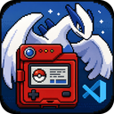
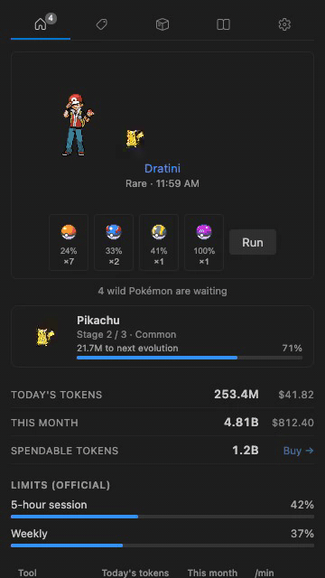

# Tokendex

**Your AI coding tokens hatch a companion that grows in VS Code.**

<!-- Once published to the Marketplace, add:

-->

Tokendex reads the tokens you already burn in **ten AI CLIs** — straight from their local
logs, nothing uploaded — and turns them into a creature that lives in your editor. Spend
tokens, hatch the egg, evolve it through its real evolution line, graduate it into your
Pokédex, and start the next journey. Underneath the game it is a precise usage tracker:
today's spend and cost, this month's, official rate-limit windows, and a per-provider
breakdown.

<!-- CAPTURE hero.gif: ~10s screen recording, dark theme. Show the status bar counter with
     the mood icon, then open the sidebar panel: hero card with an animated sprite, progress
     bar, provider table. Ideally catch a celebration toast. 800px wide reads well. -->

## What you get

- **A status bar that answers at a glance** — today's tokens (or your official limit %, when
  known), your companion's mood, and a tooltip with the full breakdown.
- **A companion raised by real work** — it hatches after real spend, evolves through its
  actual evolution line, can be shiny, has a nature, and graduates into a persistent Pokédex.
- **Celebrations** — hatches, evolutions, graduations and rare-candy grants arrive as
  notifications, in your language (EN · 한국어 · 日本語 · ES).
- **The full panel** — usage totals with exact values on hover, official limit windows as
  bars, a shop and bag fed by your spend, and the Pokédex.
- **A compact companion card** wherever you want it: the Explorer, the Tokendex sidebar, or
  the panel area next to your terminal (`tokendex.companionLocation`).

<!-- CAPTURE panel-home.png: sidebar panel, Home tab, with a raised companion (not an egg),
     limits section visible. ~300px wide, dark theme. -->
<!-- CAPTURE panel-dex.png: Dex tab with several species collected, one shiny if possible. -->
<!-- CAPTURE companion-card.png: the compact card in the Explorer, ~120px tall section. -->

|                        Panel                        |                      Pokédex                       |                     Companion card                      |
| :-------------------------------------------------: | :------------------------------------------------: | :-----------------------------------------------------: |
|  |  |  |

## How it reads your usage

Local log files only — providers you do not use never appear:

| Provider    | Location                                                         |
| ----------- | ---------------------------------------------------------------- |
| Claude Code | `~/.claude/projects` (plus `CLAUDE_CONFIG_DIR`, comma-separated) |
| Codex       | `~/.codex/sessions`                                              |
| Gemini      | `~/.gemini/tmp`                                                  |
| Grok        | `~/.grok/sessions` (plus `GROK_HOME`)                            |
| Antigravity | `~/.gemini/antigravity-cli/conversations`                        |
| Cursor      | the editor's `state.vscdb`                                       |
| Copilot     | the CLI's history store (plus `COPILOT_HOME`)                    |
| OpenCode    | `~/.local/share/opencode` (plus `OPENCODE_DATA_DIR`)             |
| Hermes      | the CLI's home (plus `HERMES_HOME`)                              |
| Kiro        | the CLI's data directory                                         |

## Privacy

Nothing is sent anywhere. Your logs are read locally and stay local. The one network call is
to [PokéAPI](https://pokeapi.co) for sprites and species data, fetched at runtime and cached
on your machine.

## Performance

Measured on a real 1.1 GB corpus (870 MB Claude Code, 259 MB Codex):

|                           |            |
| ------------------------- | ---------- |
| First scan ever           | ~6 s, once |
| Startup with a warm cache | ~170 ms    |
| Each refresh              | ~90–115 ms |

Scanning runs in a `worker_thread`, never on the extension host, so VS Code is never blocked.
An idle refresh writes nothing; an open panel re-renders instead of re-scanning.

## Settings

| Setting                      | Default    | What it does                           |
| ---------------------------- | ---------- | -------------------------------------- |
| `tokendex.refreshInterval`   | `120` s    | How often local usage is re-read       |
| `tokendex.companionLocation` | `explorer` | Where the compact companion card lives |

### Working in WSL

Install the extension inside your WSL window. It declares `"extensionKind": ["workspace"]`,
so the extension host runs where your logs are and reads them at native speed — reading a WSL
home from Windows across the `\\wsl$` bridge was measured at ~17× slower.

## Contributing

Issues and pull requests are welcome — see [CONTRIBUTING.md](CONTRIBUTING.md) for the build
steps, the gitmoji commit convention, and the extension points for adding a new AI CLI.

## Credits

Pokémon and Pokémon character names are trademarks of Nintendo. This project is a fan work,
is not affiliated with or endorsed by Nintendo, Creatures Inc. or GAME FREAK Inc., and bundles
no Pokémon assets — sprites are fetched from PokéAPI at runtime; the icon artwork is
first-party.

## Licence

MIT — see [`LICENSE`](LICENSE).
