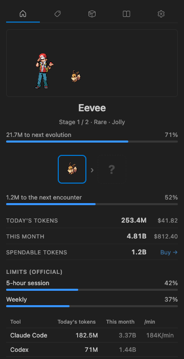
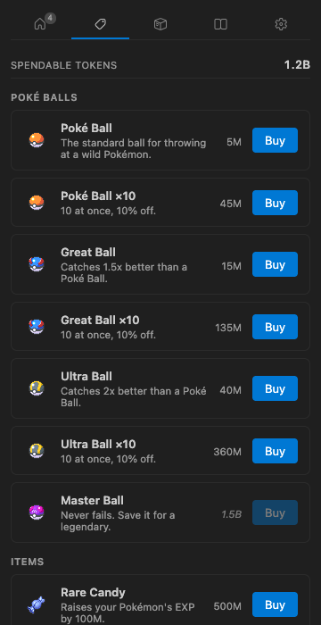
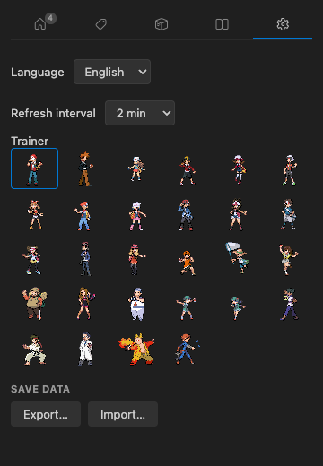
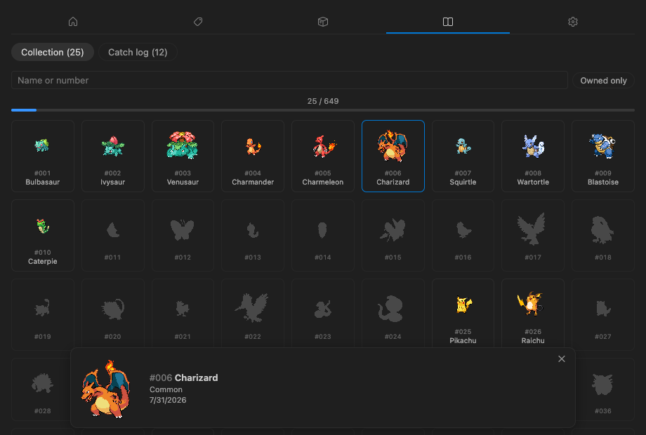

# Tokendex

**Your AI coding tokens hatch, raise and catch Pokémon — right inside VS Code.**

<!-- Once published to the marketplaces, add:

-->

 

<em>A wild Dratini appeared. 24% with a Poké Ball, 41% with an Ultra — or the Master Ball never fails.</em>

 

You already burn millions of tokens a day in Claude Code, Codex, Gemini and friends.
**Tokendex reads those local logs — nothing is uploaded, ever — and turns the spend you
already made into a game**: an egg incubates on real work, hatches into a companion that
evolves through its actual evolution line, and wild Pokémon walk into your editor as you
code. Throw a ball. Watch the wobbles. Fill the Pokédex.

Underneath the game sits a precise, fast usage tracker: today's tokens and cost, this
month's, official rate-limit windows as live bars, and a per-CLI breakdown with burn rate.

## The game

- 🥚 **Hatch** — your egg incubates on real token spend (5M to hatch), then evolves through
  its species' real evolution line, stage by stage, until it graduates into your Pokédex.
- 🎯 **Catch** — wild Pokémon appear as you work (the first after just 500k tokens). They
  wait in a quiet queue: a badge counts them, and only a shiny or a legendary ever toasts —
  at most once per hour. Never an interruption.
- ⚖️ **Decide** — every ball shows its real catch odds for the Pokémon on stage, computed
  with the Gen-IV catch formula on the species' true capture rate. A miss can make it flee,
  and the pressure rises with every failed throw. Running from a rare asks first.
- ✨ **Get lucky** — shinies (1/64, better with the Shiny Charm), natures, a Ditto that
  reveals itself mid-evolution, and guaranteed-tier eggs.
- 🛍️ **Spend what you earned** — the tokens you burn are also your wallet: Poké, Great,
  Ultra and Master Balls (ten-packs at 10% off), Rare Candy, Mints, the Shiny Charm.

|                                                                          Raise                                                                           |                                                                       Shop                                                                        |                                                Your trainer                                                 |
| :------------------------------------------------------------------------------------------------------------------------------------------------------: | :-----------------------------------------------------------------------------------------------------------------------------------------------: | :---------------------------------------------------------------------------------------------------------: |
|  |  |  |

<em>The Pokédex tracks every species you raise or catch — 649 to collect.</em>

## The tracker

- **Status bar at a glance** — your official limit % (or today's tokens), plus your
  companion's mood. Hover for the full breakdown — companion portrait included.
- **Official rate-limit windows** for Claude and Codex as live bars, polled off the scan
  path so a refresh never waits on the network. Exhausting a window grants Rare Candy.
- **Per-CLI breakdown** with today, this month and live burn (`/min`) while a session runs.
- **Four languages** — English, 한국어, 日本語, Español — down to the toasts.
- **Save export/import** with a validated envelope and automatic pre-import backup.

## Works with what you already use

Local log files only — providers you do not use never appear:

| Provider    | Location                                                         |
| ----------- | ---------------------------------------------------------------- |
| Claude Code | `~/.claude/projects` (plus `CLAUDE_CONFIG_DIR`, comma-separated) |
| Codex       | `~/.codex/sessions`                                              |
| Gemini      | `~/.gemini/tmp`                                                  |
| Grok        | `~/.grok/sessions` (plus `GROK_HOME`)                            |
| Antigravity | `~/.gemini/antigravity-cli/conversations`                        |
| Cursor      | the editor's `state.vscdb`                                       |
| Copilot     | the CLI's history store (plus `COPILOT_HOME`)                    |
| OpenCode    | `~/.local/share/opencode` (plus `OPENCODE_DATA_DIR`)             |
| Hermes      | the CLI's home (plus `HERMES_HOME`)                              |
| Kiro        | the CLI's data directory                                         |

One `.vsix` for every platform: SQLite-backed providers are read through
[sql.js](https://sql.js.org) (WebAssembly), so there are no native modules to compile.

## Privacy

Nothing is sent anywhere. Your logs are read locally and stay local. The only network calls
fetch sprites and species data at runtime — from [PokéAPI](https://pokeapi.co) and
[Pokémon Showdown](https://play.pokemonshowdown.com) — and are cached on your machine.

## Performance

Measured on a real 1.1 GB corpus (870 MB Claude Code, 259 MB Codex):

|                           |            |
| ------------------------- | ---------- |
| First scan ever           | ~6 s, once |
| Startup with a warm cache | ~170 ms    |
| Each refresh              | ~90–115 ms |

Scanning runs in a `worker_thread`, never on the extension host, so VS Code is never
blocked. An idle refresh writes nothing; an open panel re-renders instead of re-scanning.

## Settings

| Setting                           | Default    | What it does                                                          |
| --------------------------------- | ---------- | --------------------------------------------------------------------- |
| `tokendex.refreshInterval`        | `120` s    | How often local usage is re-read (also in the panel's Settings tab)   |
| `tokendex.companionLocation`      | `explorer` | Where the compact companion card lives                                |
| `tokendex.encounterNotifications` | `rare`     | Encounter toasts: `rare` (shiny/legendary, max one per hour) or `off` |

### Working in WSL

Install the extension inside your WSL window. It declares `"extensionKind": ["workspace"]`,
so the extension host runs where your logs are and reads them at native speed — reading a WSL
home from Windows across the `\\wsl$` bridge was measured at ~17× slower.

## Contributing

Issues and pull requests are welcome — see [CONTRIBUTING.md](CONTRIBUTING.md) for the build
steps, the gitmoji commit convention, and the extension points for adding a new AI CLI.

## Credits

Pokémon and Pokémon character names are trademarks of Nintendo. This project is a fan work
and is not affiliated with or endorsed by Nintendo, Creatures Inc. or GAME FREAK Inc. No game
sprites are bundled — Pokémon and item sprites are fetched from [PokéAPI](https://pokeapi.co)
at runtime, trainer sprites from [Pokémon Showdown](https://play.pokemonshowdown.com). The
extension icon is original fan artwork.

## Licence

MIT — see [`LICENSE`](LICENSE).
